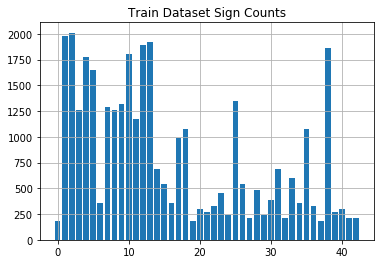
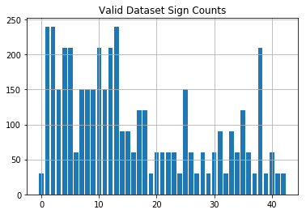
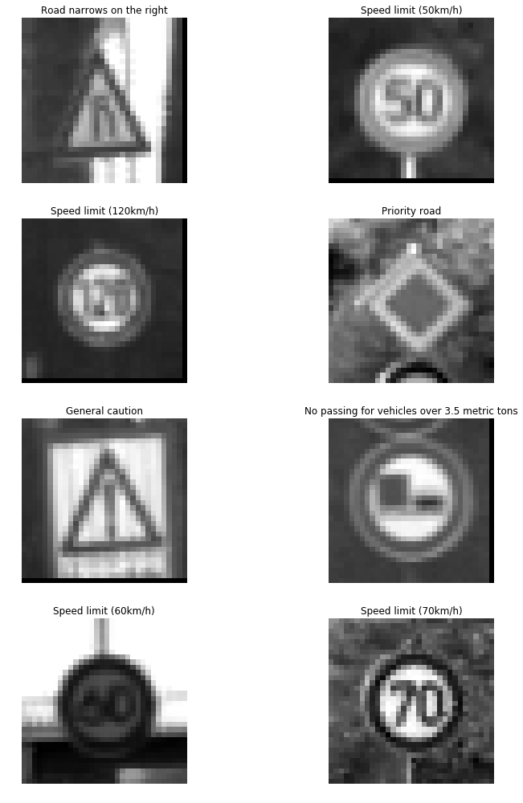
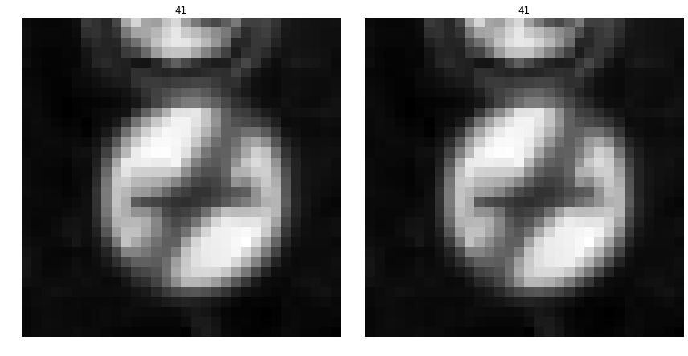
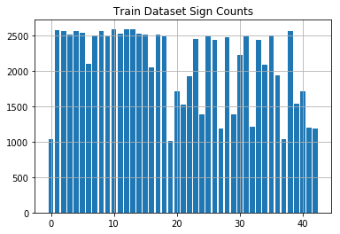
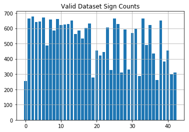

# **Traffic Sign Recognition** 

## Writeup

### You can use this file as a template for your writeup if you want to submit it as a markdown file, but feel free to use some other method and submit a pdf if you prefer.

---

**Build a Traffic Sign Recognition Project**

The goals / steps of this project are the following:
* Load the data set (see below for links to the project data set)
* Explore, summarize and visualize the data set
* Design, train and test a model architecture
* Use the model to make predictions on new images
* Analyze the softmax probabilities of the new images
* Summarize the results with a written report


[//]: # (Image References)

[image1]: ./examples/visualization.jpg "Visualization"
[image2]: ./examples/grayscale.jpg "Grayscaling"
[image3]: ./examples/random_noise.jpg "Random Noise"
[image4]: ./examples/placeholder.png "Traffic Sign 1"
[image5]: ./examples/placeholder.png "Traffic Sign 2"
[image6]: ./examples/placeholder.png "Traffic Sign 3"
[image7]: ./examples/placeholder.png "Traffic Sign 4"
[image8]: ./examples/placeholder.png "Traffic Sign 5"

## Rubric Points
### Here I will consider the [rubric points](https://review.udacity.com/#!/rubrics/481/view) individually and describe how I addressed each point in my implementation.  

---
### Writeup / README

#### 1. Provide a Writeup / README that includes all the rubric points and how you addressed each one. You can submit your writeup as markdown or pdf. You can use this template as a guide for writing the report. The submission includes the project code.

You're reading it! and here is a link to my [project code](https://github.com/udacity/CarND-Traffic-Sign-Classifier-Project/blob/master/Traffic_Sign_Classifier.ipynb)


### Data Set Summary & Exploration

#### 1. Provide a basic summary of the data set. In the code, the analysis should be done using python, numpy and/or pandas methods rather than hardcoding results manually.

I used the numpy library to calculate summary statistics of the traffic signs data set:


```python
### Replace each question mark with the appropriate value. 
### Use python, pandas or numpy methods rather than hard coding the results
import numpy as np
# TODO: Number of training examples
n_train = X_train.shape[0]

# TODO: Number of validation examples
n_validation = X_valid.shape[0]

# TODO: Number of testing examples.
n_test = X_test.shape[0]

# TODO: What's the shape of an traffic sign image?
image_shape = X_train.shape[1:]

# TODO: How many unique classes/labels there are in the dataset.
n_classes = len(np.unique(y_train))

```
The size of training set is 34799
The size of test set is 12630
The shape of a traffic sign image is (32, 32, 3)
The number of unique classes/labels in the data set is 43


#### 2. Include an exploratory visualization of the dataset.

Here is an exploratory visualization of the data set. It pulls in a random set of 8 images and labels them with the correct names in reference with the csv file to their respective id's.

```python

import matplotlib.pyplot as plt
# Visualizations will be shown in the notebook.
%matplotlib inline
import random
import csv

def plot_figures(figures, nrows = 1, ncols=1, labels=None):
    fig, axs = plt.subplots(ncols=ncols, nrows=nrows, figsize=(12, 14))
    axs = axs.ravel()
    for index, title in zip(range(len(figures)), figures):
        axs[index].imshow(figures[title], plt.gray())
        if(labels != None):
           axs[index].set_title(labels[index])
        else:
            axs[index].set_title(title)
            
        axs[index].set_axis_off()
        
    plt.tight_layout()
    
```


I also detail the dataset structure by plotting the occurrence of each image class to see how the data is distributed. This can help understand where potential pitfalls could occur if the dataset isn't uniform in terms of a baseline occurrence.


```python
unique_train, counts_train = np.unique(y_train, return_counts=True)
plt.bar(unique_train, counts_train)
plt.grid()
plt.title("Train Dataset Sign Counts")
plt.show()

unique_test, counts_test = np.unique(y_test, return_counts=True)
plt.bar(unique_test, counts_test)
plt.grid()
plt.title("Test Dataset Sign Counts")
plt.show()

unique_valid, counts_valid = np.unique(y_valid, return_counts=True)
plt.bar(unique_valid, counts_valid)
plt.grid()
plt.title("Valid Dataset Sign Counts")
plt.show()
```







### Design and Test a Model Architecture

#### 1. Describe how you preprocessed the image data. What techniques were chosen and why did you choose these techniques? Consider including images showing the output of each preprocessing technique. Pre-processing refers to techniques such as converting to grayscale, normalization, etc. (OPTIONAL: As described in the "Stand Out Suggestions" part of the rubric, if you generated additional data for training, describe why you decided to generate additional data, how you generated the data, and provide example images of the additional data. Then describe the characteristics of the augmented training set like number of images in the set, number of images for each class, etc.)

I decided to convert the images to grayscale. I assume this works better because the excess information might add extra confusion into the learning process. After the grayscale I also normalized the image data because I've read it helps in speed of training and performance because of things like resources. Also added additional images to the datasets through randomized modifications.

Here is an example of a traffic sign images that were randomly selected.

```python
# Convert to grayscale
X_train_rgb = X_train
X_train_gray = np.sum(X_train/3, axis=3, keepdims=True)

X_test_rgb = X_test
X_test_gray = np.sum(X_test/3, axis=3, keepdims=True)

X_valid_rgb = X_valid
X_valid_gray = np.sum(X_valid/3, axis=3, keepdims=True)

```

```python
# X_train = tf.image.rgb_to_grayscale(X_train, name=None)
X_train = X_train_gray
X_test = X_test_gray
X_valid = X_valid_gray

image_depth_channels = X_train.shape[3]

# print(image_depth_channels)

```


Here is a look at the normalized images. Which should look identical, but for some small random alterations such as opencv affine and rotation.

```python
def normalize(im):
    return -np.log(1/((1 + im)/257) - 1)

# X_train_normalized = normalize(X_train)
# X_test_normalized = normalize(X_test)
X_train_normalized = X_train/127.5-1
X_test_normalized = X_test/127.5-1

```




#### 2. Describe what your final model architecture looks like including model type, layers, layer sizes, connectivity, etc.) Consider including a diagram and/or table describing the final model.

I did a few random alterations to the images and saved multiple copies of them depending on the total images in the dataset class type.

Here is an example of 1 image I changed at random. More can be seen further in the document, but the original is on the right and the randomized opencv affine change is on the left. Small rotations are also visible further along as stated.



I increased the train dataset size to 89860 and also merged and then remade another validation dataset. Now no image class in the train set has less then 1000 images.

```python
from sklearn.model_selection import train_test_split
X_train, X_valid, y_train, y_valid = train_test_split(X_train, y_train, test_size=0.2, random_state=0)

print("New Dataset Size : {}".format(X_train.shape[0]))

unique, counts = np.unique(y_train, return_counts=True)
plt.bar(unique, counts)
plt.grid()
plt.title("Train Dataset Sign Counts")
plt.show()

unique, counts = np.unique(y_test, return_counts=True)
plt.bar(unique, counts)
plt.grid()
plt.title("Test Dataset Sign Counts")
plt.show()

unique, counts = np.unique(y_valid, return_counts=True)
plt.bar(unique, counts)
plt.grid()
plt.title("Valid Dataset Sign Counts")
plt.show()
```

    New Dataset Size : 89860




Validation set gained 20% of the original total mentioned above. I did this using scikit learns train test split method.




#### 3. Describe how you trained your model. The discussion can include the type of optimizer, the batch size, number of epochs and any hyperparameters such as learning rate.

To train the model, I used an ....

```python
### Train your model here.
### Calculate and report the accuracy on the training and validation set.
### Once a final model architecture is selected, 
### the accuracy on the test set should be calculated and reported as well.
### Feel free to use as many code cells as needed.
EPOCHS = 27
BATCH_SIZE = 156

rate = 0.00097

logits = LeNet(x)

cross_entropy = tf.nn.softmax_cross_entropy_with_logits(logits=logits, labels=one_hot_y)
loss_operation = tf.reduce_mean(cross_entropy)
optimizer = tf.train.AdamOptimizer(learning_rate = rate)
training_operation = optimizer.minimize(loss_operation)

correct_prediction = tf.equal(tf.argmax(logits, 1), tf.argmax(one_hot_y, 1))
accuracy_operation = tf.reduce_mean(tf.cast(correct_prediction, tf.float32))
saver = tf.train.Saver()

def evaluate(X_data, y_data):
    num_examples = len(X_data)
    total_accuracy = 0
    sess = tf.get_default_session()
    for offset in range(0, num_examples, BATCH_SIZE):
        batch_x, batch_y = X_data[offset:offset+BATCH_SIZE], y_data[offset:offset+BATCH_SIZE]
        accuracy = sess.run(accuracy_operation, feed_dict={x: batch_x, y: batch_y, keep_prob: 1.0})
        total_accuracy += (accuracy * len(batch_x))
    return total_accuracy / num_examples

```


| Layer         		|     Description	        					| 
|:---------------------:|:---------------------------------------------:| 
| Input         		| 32x32x1 RGB image   							| 
| Convolution 3x3     	| 2x2 stride, valid padding, outputs 28x28x6 	|
| RELU					|												|
| Max pooling	      	| 2x2 stride,  outputs 14x14x64 				|
| Convolution 5x5	    | 2x2 stride, valid padding output 10x10x6 	|
| RELU		            |            									|
| Max Pooling			| 2x2 stride, outputs 5x5x16					|
| Convolution 1x1		| 2x2 stride, valid padding, outputs 1x1x412 	|
| RELU                  |												|
| Fully connected		| input 412, output 122 						|
| RELU				    |           									|
| Dropout				| 50% Keep   									|
| Fully connected		| input 122, output 84  						|
| RELU				    |           									|
| Dropout				| 50% Keep   									|
| Fully connected		| input 84, output 43   						|
 
#### 4. Describe the approach taken for finding a solution and getting the validation set accuracy to be at least 0.93. Include in the discussion the results on the training, validation and test sets and where in the code these were calculated. Your approach may have been an iterative process, in which case, outline the steps you took to get to the final solution and why you chose those steps. Perhaps your solution involved an already well known implementation or architecture. In this case, discuss why you think the architecture is suitable for the current problem.

To train the model, I used an LeNet for the most part that was given, but I did add an additional convolution without a max pooling layer after it like in the udacity lesson. I used the AdamOptimizer with a learning rate of 0.00097. The epochs used was 27 while the batch size was 156. Other important parameters I learned were important was the number and distribution of additional data generated. I played around with various different distributions of image class counts and it had a dramatic effect on the training set accuracy. It didn't really have much of an effect on the test set accuracy, or real world image accuracy. Even just using the default settings from the Udacity lesson leading up to this point I was able to get 94% accuracy with virtually no changes on the test set. When I finally stopped testing I got 94-95.2% accuracy on the test set though so I think the extra data improved training accuracy, but not a huge help for test set accuracy. Although this did help later on with the images from the internet.

```python
plt.plot(validation_accuracy_figure)
plt.title("Test Accuracy")
plt.show()

plt.plot(validation_accuracy_figure)
plt.title("Validation Accuracy")
plt.show()
```


My final model results were:

```python
with tf.Session() as sess:
    saver.restore(sess, tf.train.latest_checkpoint('.'))

    train_accuracy = evaluate(X_train, y_train)
    print("Train Accuracy = {:.3f}".format(train_accuracy))
    
    valid_accuracy = evaluate(X_valid, y_valid)
    print("Valid Accuracy = {:.3f}".format(valid_accuracy))    
    
    test_accuracy = evaluate(X_test, y_test)
    print("Test Accuracy = {:.3f}".format(test_accuracy))

```

    INFO:tensorflow:Restoring parameters from ./lenet
    Train Accuracy = 1.000
    Valid Accuracy = 0.993
    Test Accuracy = 0.951


Training set accuracy of 100.0%
validation set accuracy of 99.3%
test set accuracy of 95.1%
If an iterative approach was chosen:

What was the first architecture that was tried and why was it chosen?
I used a very similar architecture to the paper offered by the instructors. I used it because they got such a good score the answer was given through it.

What were some problems with the initial architecture?
The first issue was lack of data for some images and the last was lack of knowledge of all the parameters. After I fixed those issues the LeNet model given worked pretty well with the defaults. I still couldn't break 98% very easily until I added another convolution. After that it was much faster at reaching higher accuracy scores.

How was the architecture adjusted and why was it adjusted?
Past what was said in the previous question, I didn't alter much past adding a couple dropouts with a 50% probability.

Which parameters were tuned? How were they adjusted and why?
Epoch, learning rate, batch size, and drop out probability were all parameters tuned along with the number of random modifications to generate more image data was tuned. For Epoch the main reason I tuned this was after I started to get better accuracy early on I lowered the number once I had confidence I could reach my accuracy goals. The batch size I increased only slightly since starting once I increased the dataset size. The learning rate I think could of been left at .001 which is as I am told a normal starting point, but I just wanted to try something different so .00097 was used. I think it mattered little. The dropout probability mattered a lot early on, but after awhile I set it to 50% and just left it. The biggest thing that effected my accuracy was the data images generated with random modifications. This would turn my accuracy from 1-10 epochs from 40% to 60% max to 70% to 90% within the first few evaluations. Increasing the dataset in the correct places really improved the max accuracy as well.

What are some of the important design choices and why were they chosen? 
I think I could go over this project for another week and keep on learning. I think this is a good question and I could still learn more about that. I think the most important thing I learned was having a more uniform dataset along with enough convolutions to capture features will greatly improve speed of training and accuracy.

 

### Test a Model on New Images

#### 1. Choose five German traffic signs found on the web and provide them in the report. For each image, discuss what quality or qualities might be difficult to classify.

Here are five German traffic signs that I found on the web:

  
 

```python
### Load the images and plot them here.
### Feel free to use as many code cells as needed.
import glob
import cv2

my_images = sorted(glob.glob('./GER_Signs/*.png'))
my_labels = np.array([1, 22, 35, 15, 37, 18])

```


```python
my_signs = np.array(my_signs)
my_signs_gray = np.sum(my_signs/3, axis=3, keepdims=True)
my_signs_normalized = my_signs_gray/127.5-1

```


I used semi-easy images to classify and even modified them slightly. I made them all uniform in size and only had one partially cut off.

#### 2. Discuss the model's predictions on these new traffic signs and compare the results to predicting on the test set. At a minimum, discuss what the predictions were, the accuracy on these new predictions, and compare the accuracy to the accuracy on the test set (OPTIONAL: Discuss the results in more detail as described in the "Stand Out Suggestions" part of the rubric).

### Predict the Sign Type for Each Image


```python
### Run the predictions here and use the model to output the prediction for each image.
### Make sure to pre-process the images with the same pre-processing pipeline used earlier.
### Feel free to use as many code cells as needed.
with tf.Session() as sess:
    sess.run(tf.global_variables_initializer())  
    saver.restore(sess, "./lenet") #===> saver = tf.train.import_meta_graph('./lenet.meta')
    my_accuracy = evaluate(my_signs_normalized, my_labels)
    print("My Data Set Accuracy = {:.3f}".format(my_accuracy))
```

### Analyze Performance


```python
### Calculate the accuracy for these 5 new images. 
### For example, if the model predicted 1 out of 5 signs correctly, it's 20% accurate on these new images.
my_single_item_array = []
my_single_item_label_array = []

```


Here are the results of the prediction:


The model was able to correctly guess 5 of the 5 traffic signs, which gives an accuracy of 100%. This compares favorably to the accuracy on the test set although I did throw it a softball.


#### 3. Describe how certain the model is when predicting on each of the five new images by looking at the softmax probabilities for each prediction. Provide the top 5 softmax probabilities for each image along with the sign type of each probability. (OPTIONAL: as described in the "Stand Out Suggestions" part of the rubric, visualizations can also be provided such as bar charts)

The code for making predictions on my final model is:


```python
### Print out the top five softmax probabilities for the predictions on the German traffic sign images found on the web. 
### Feel free to use as many code cells as needed.
k_size = 5
softmax_logits = tf.nn.softmax(logits)
top_k = tf.nn.top_k(softmax_logits, k=k_size)

with tf.Session() as sess:
    sess.run(tf.global_variables_initializer())
#     my_saver = tf.train.import_meta_graph('./lenet.meta')
    saver.restore(sess, "./lenet")
    my_softmax_logits = sess.run(softmax_logits, feed_dict={x: my_signs_normalized, keep_prob: 1.0})
    my_top_k = sess.run(top_k, feed_dict={x: my_signs_normalized, keep_prob: 1.0})
#     print(my_top_k)

```


